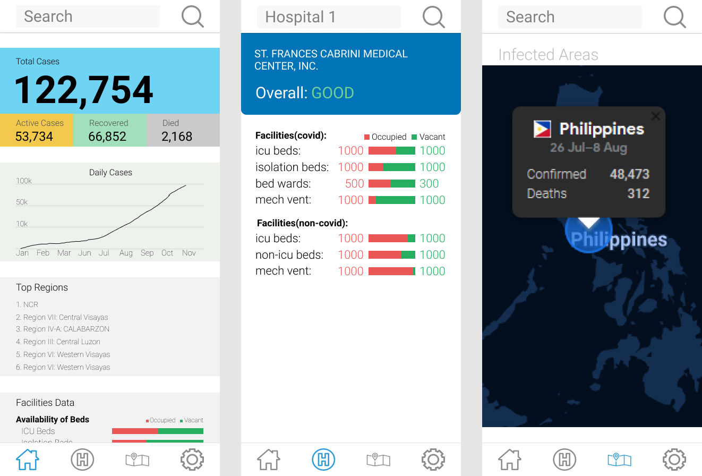

# Covid-19 Philippines App (Pre-Alpha)

### An App focused on delivering rich information about covid-19 related data in Philippines. It includes overview/breakdown of total cases, facilities data, hospital finder, geography of covid cases.

 

## 📹 Demo

Features:
- [x] View summary (total, active, recovered, died cases)
- [x] View timeline curve
- [x] View top regions
- [x] View facilities summary (beds occupancy rate)
- [ ] View hospitals in-depth data
- [ ] View maps with geographic data of covid cases

 

## 📷 Initial Prototype Screenshots

Implemented:
- [x] First Page
- [ ] Second Page
- [ ] Third Page

### Protoype was developed from scratch with UX principle in mind.

 

## 🔧 Built With

### [Flutter](https://flutter.dev/) - Flutter is Google’s UI toolkit for building beautiful, natively compiled applications for mobile, web, and desktop from a single codebase.

 

## Acknowledgments

* 💗 [Covid-19-API-Philippines-DOH](https://github.com/Simperfy/Covid-19-API-Philippines-DOH) - API used

 

## Authors

<table>
  <tr>
      <td align="center">
          <a href="https://github.com/Simperfy">
              
               
              
                  <b>Simperfy</b>
              
          </a>
           
          <a href="#" title="Frontend">🖼️</a>
          <a href="#" title="Reviewed Pull Requests">👀</a>
          <a href="#" title="Documentation">📖</a>
      </td>
      <td align="center">
          <a href="https://github.com/DauntlessDev">
              
               
              
                  <b>DauntlessDev</b>
              
          </a>
           
          <a href="#" title="Backend">🕹️</a>
          <a href="#" title="Reviewed Pull Requests">👀</a>
          <a href="#" title="Documentation">📖</a>
      </td>
  </tr>
</table>